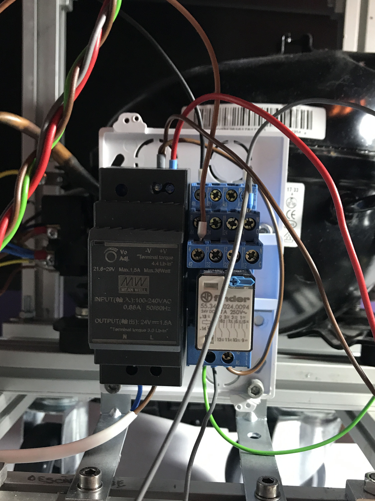

# DIY-air-compressor
DIY Project - Silent air compressor for indoor use

Fixing computers and laptops as a hobby has led me to use a lot of compressed air cans. Working in a factory where compressed air was basically unlimited through pipes around the office is where I found out that the time of compressed air cans was gone. So I got to work building the frame and main components having a good concept in my mind of what the thing should look like.

One of the main features that I was interested in developing was near silent indoor operation, similar to a standard air compressor. In order to meet this requirement the compressor pump used is pretty silent, with it being taken from a refrigerator. I also opted for an industrial design as I believe it would fit the theme quite nicely.

Here are some pictures of the journey:

 

 

 

 

