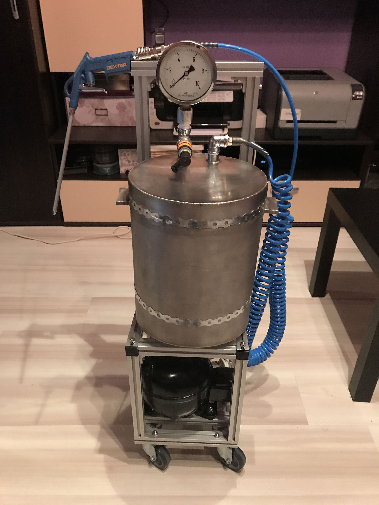
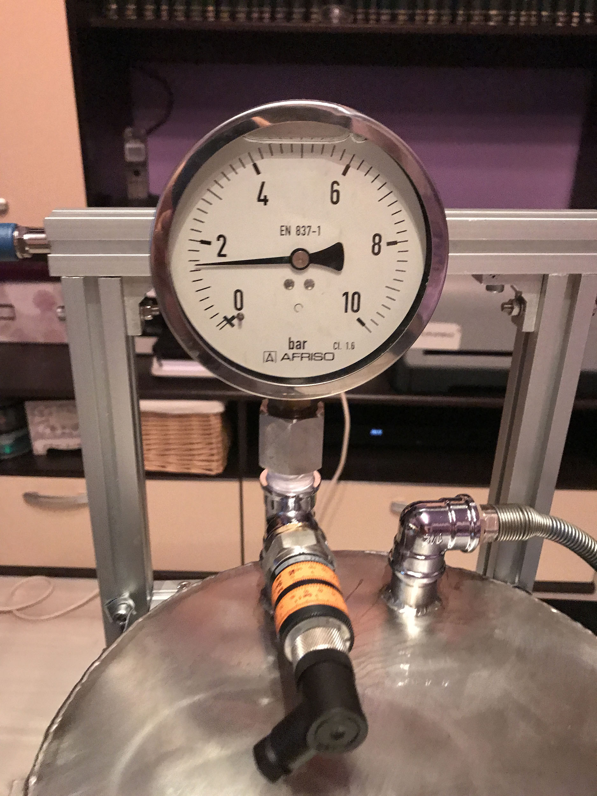

# DIY-air-compressor
DIY Project - Silent air compressor for indoor use

Fixing computers and laptops as a hobby has led me to use a lot of compressed air cans. Working in a factory where industrial compressed air was at discretion through pipes around the office is where I found out that the time of compressed air cans was gone. So I got to work building the frame and main components having a good concept in my mind of what the thing should look like.

Above the industrial design that the project has, one of the main requirement that this project has is that I wanted it to be possible to be operated indoors without making noise, as a normal air compressor does. To meet this requirement the compressor pump used is near silent, it was taken from a refrigerator.

Here are some pictures of the journey:

